# 🎮 Rock Paper Scissors - User Guide 🎮

You can play the game by visiting the following link:

👉 [Rock Paper Scissors Game - Live Demo](http://134.209.232.182:4200/)

## Home
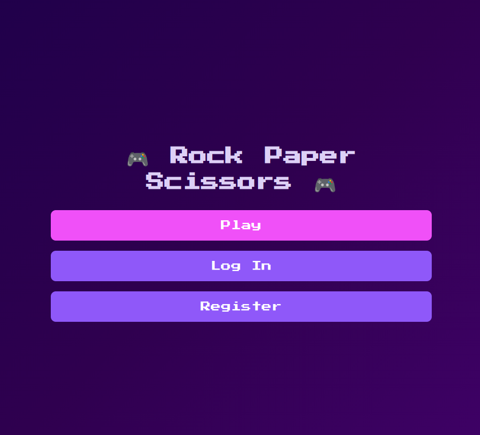
<br>
The home screen is the entry point of the game. From here, you can:

Configure your game settings.
Choose between single-player and multiplayer modes.
Access your game history.

## Game Settings (Unregistered User)
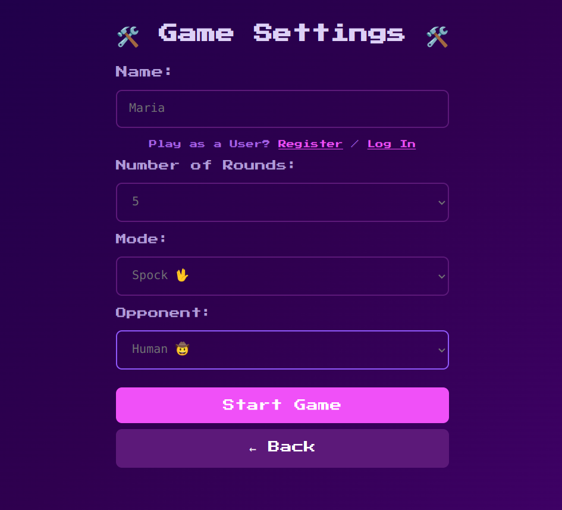
<br>
In the game settings screen:

Rounds: Set the number of rounds (e.g., 3, 5).
Game Mode: Select "Classic" (Rock, Paper, Scissors) or "Extended" (Rock, Paper, Scissors, Lizard, Spock).
Play Options: Start a single-player game against the computer or create a multiplayer game with a sharable link.

### Game Settings (Logged-in User)
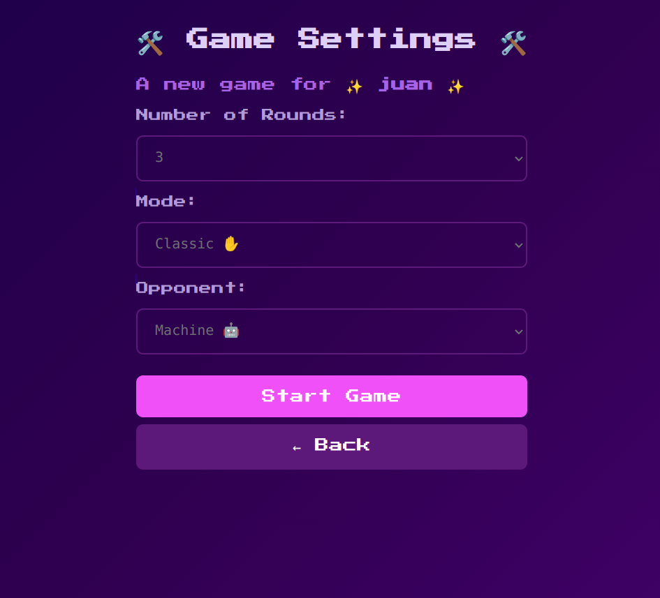
<br>
When logged in, additional features are available:

Your profile (name and avatar) is displayed.
You can save game results and easily play with friends.

### Shared Game Settings
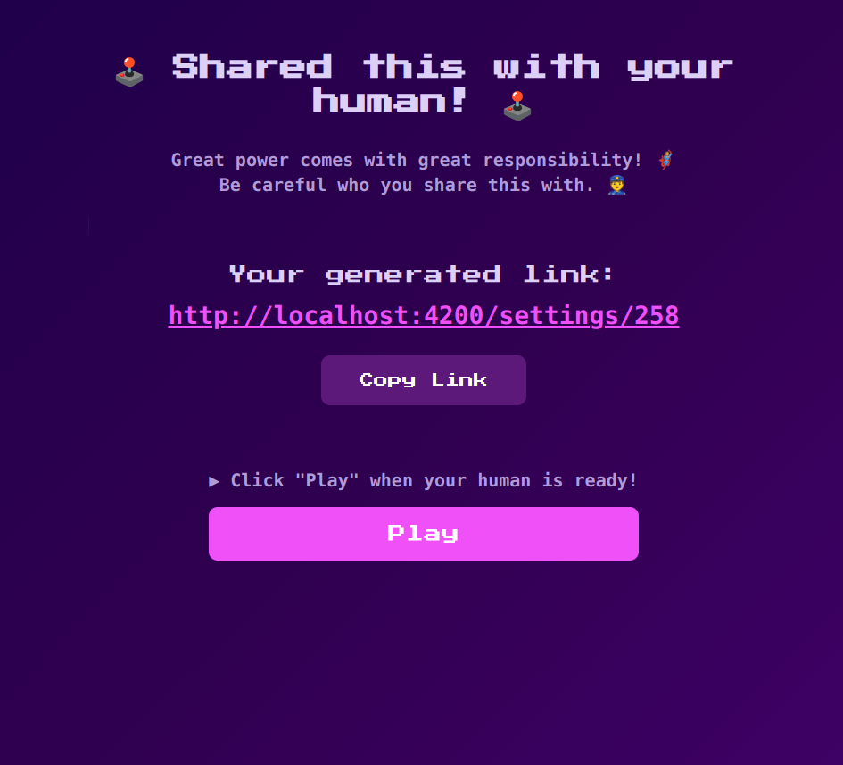
<br>
If you choose multiplayer, a unique link is generated. Share this link with a friend to join the same game.

## Play
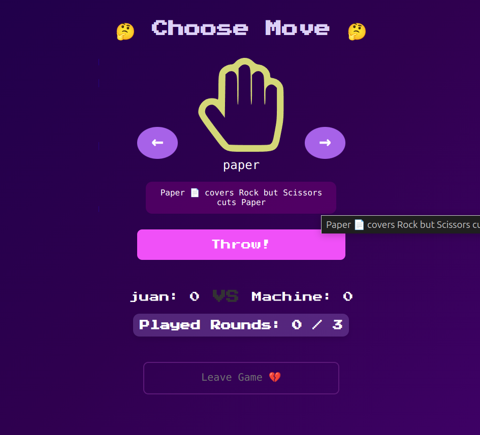
<br>
In single-player mode:

Play against the computer by selecting your move (Rock, Paper, Scissors, etc.).
The game will automatically proceed until a winner is determined.
Multiplayer Gameplay

### Waiting for Player
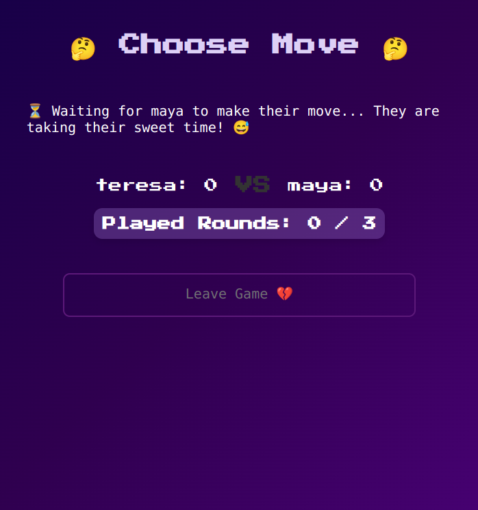
<br>
After sharing the link, the game will wait for the second player to join.

### Player Interaction
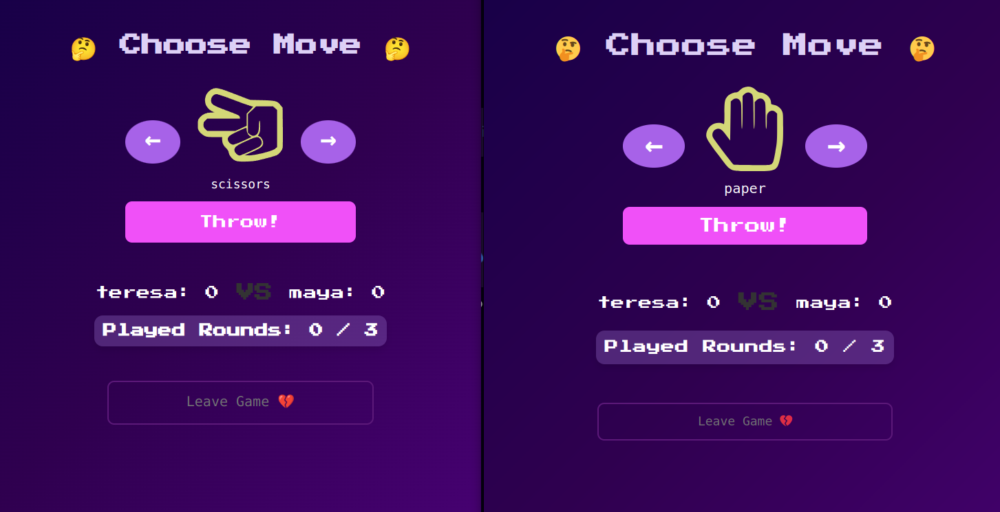
<br>
Both players select their moves in secret.

### Round Results
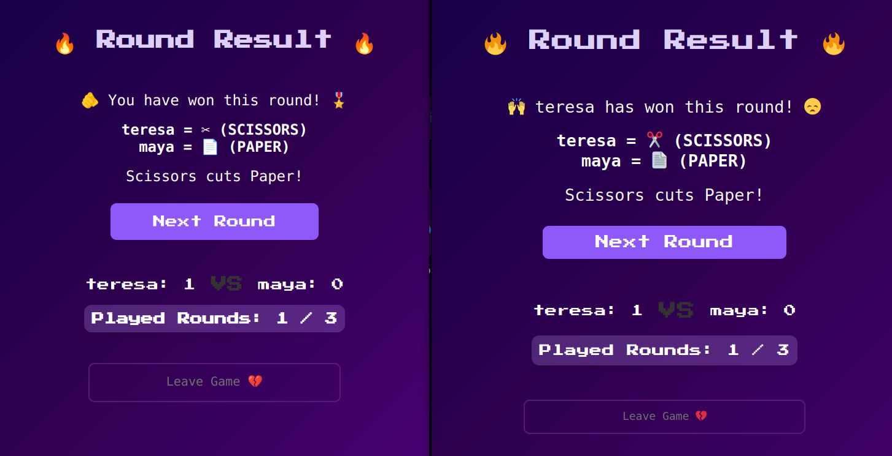
<br>
Once both players submit their moves, the results for the round are displayed.

### Game Results
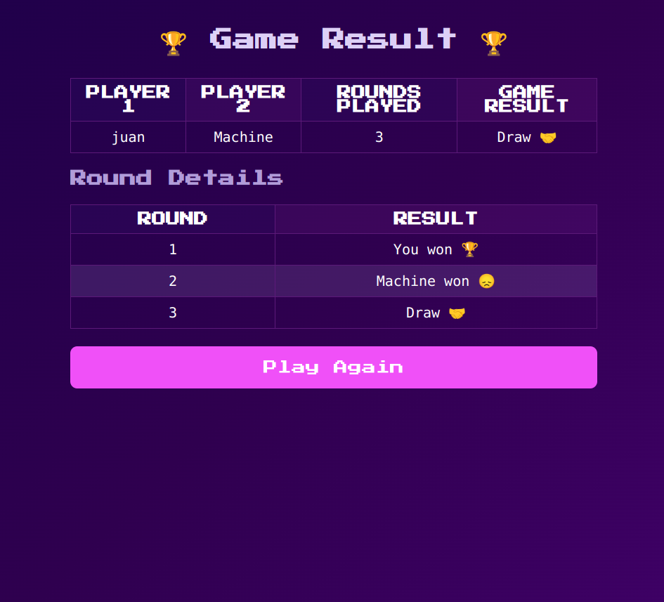
<br>
At the end of the game:

The overall winner is displayed.
A round-by-round summary is available.
Login & Registration

## Register
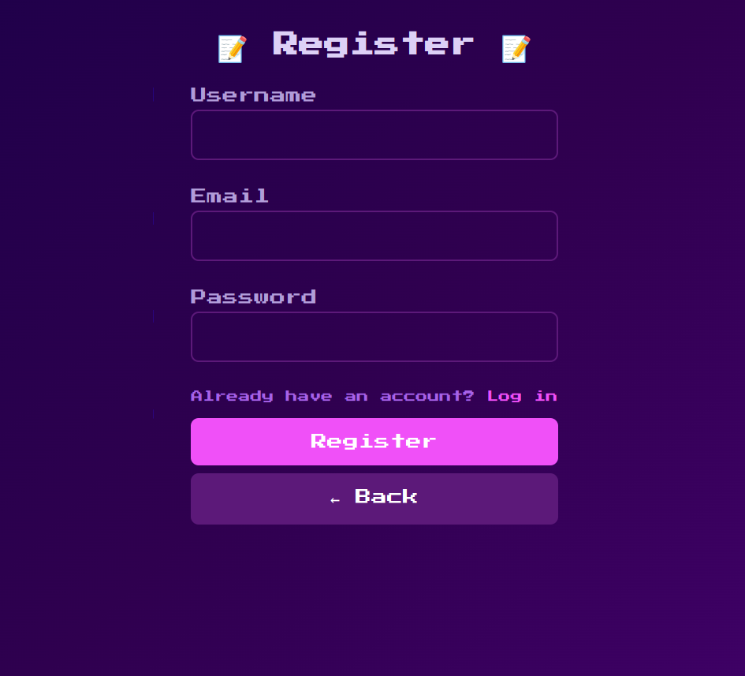
<br>
Create an account by completing the registration form to unlock features such as saving game data and accessing multiplayer more easily.

### Login
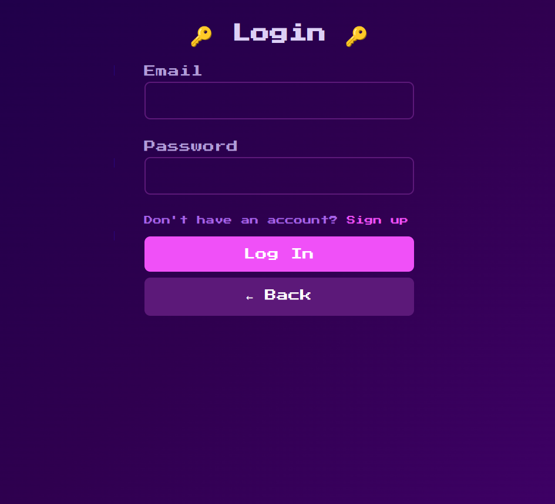
<br>
Log into your account to access personalized settings, save game results, and view your game history.

### Logged-in Dashboard
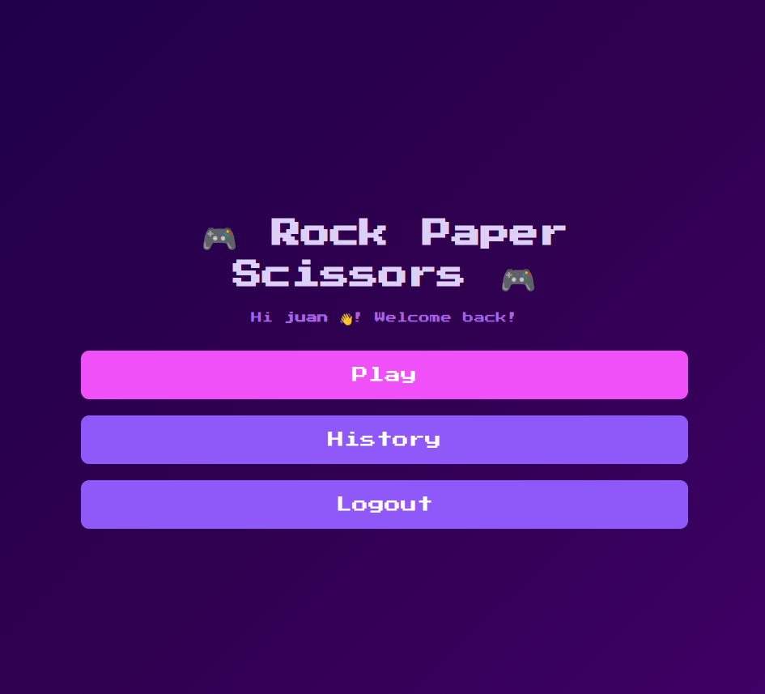
<br>
Once logged in:

Your profile name and avatar will be displayed.
You can access additional features, including saved game history.

## Game History
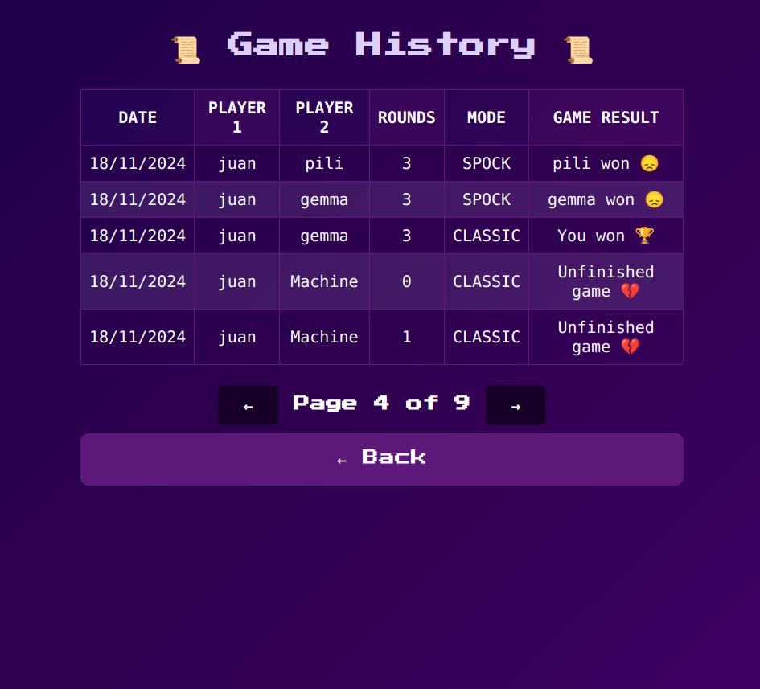
<br>
View your previous games, including:

Game modes played.
Number of rounds.
Outcomes and overall performance.


---

# ⚙️ Technical Specifications ⚙️

This project is a full-stack **Rock-Paper-Scissors** game with the **Front-End built using Angular (v18)** and the **Back-End built using Spring Boot (v3.3)**. The game supports both single-player (against the computer) and multiplayer (two human players) modes.

## Features

### Front-End:
- Built with **Angular v18**.
- Interactive UI for playing the game.
- Supports both single-player and two players mode.

### Back-End:
- Built with **Spring Boot v3.3**.
- **REST API** to manage game creation and gameplay.
- **JWT Authentication** for securing the API.
- Database support using **MySQL**.

## Requirements

### Front-End (Angular)
- **Node.js** (LTS version recommended).
- **Angular CLI** (Global installation).

### Back-End (Spring Boot)
- **Java 17+** (For compiling and running the application).
- **Maven** (For dependency management).
- **Spring Boot 3.3** (Backend framework).
- **MySQL** or another relational database.

---

## Setup Instructions

### 1. Clone the Repository

Clone this repository to your local machine:

```bash
git clone https://github.com/yourusername/rock-paper-scissors.git
```
---
### 2. Front-End Setup (Angular)
#### 2.1. Navigate to the Front-End Directory
First, navigate to the front-end directory:

```bash
cd rock-paper-scissors/frontend
```
#### 2.2. Install Dependencies
```bash
npm install
```
#### 2.3. Configure the Front-End API URL
In src/environments/environment.ts, update the apiUrl and webUrl to match your local back-end and front-end URLs:
```bash
export const environment = {
  production: false,
  apiUrl: 'http://localhost:8080',  // Back-End URL
  webUrl: 'http://localhost:4200'   // Front-End URL
};
```
#### 2.4. Serve the Angular Application
Start the development server:
```bash
ng serve
```
This will start the Angular app, and it will be available at http://localhost:4200.

---
## 3. Back-End Setup (Spring Boot)
#### 3.1. Navigate to the Back-End Directory
Navigate to the back-end directory:

```bash
cd rock-paper-scissors/backend
```

#### 3.2. Install Dependencies
Run the following Maven command to install the required dependencies:

```bash
mvn install
```

#### 3.3. Configure the Database
The back-end uses MySQL.

1. Create a MySQL database (e.g., rockpaperscissors).
2. Update the src/main/resources/application.properties file with your MySQL credentials:
   
```bash
spring.application.name=back-end

# DB Configuration
spring.datasource.url= ## your datasource
spring.datasource.username= ## your username
spring.datasource.password= ## your password
spring.datasource.driver-class-name=com.mysql.cj.jdbc.Driver

# JPA/Hibernate Configuration
spring.jpa.hibernate.ddl-auto=update
spring.jpa.show-sql=true
spring.jpa.properties.hibernate.dialect=org.hibernate.dialect.MySQLDialect

# CORS Configuration
cors.allowedOrigins= # http://localhost:4200 or yours

# Logging Configuration
logging.level.org.springframework.web=DEBUG
logging.level.org.springframework.messaging=DEBUG
logging.level.org.springframework.web.socket=DEBUG
```
#### 3.4. Run the Spring Boot Application
To run the back-end application:
```bash
mvn spring-boot:run
```
The back-end will be available at http://localhost:8080.
